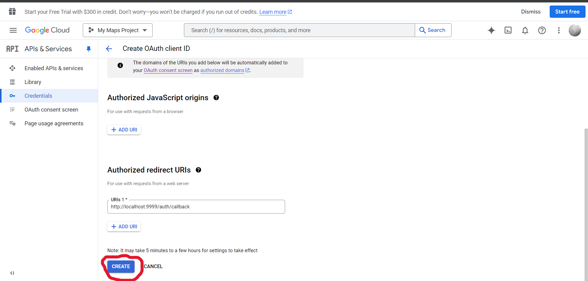

# Simple OAuth2 Implementation in Go

This project demonstrates a simple implementation of OAuth2 authentication using Google as the OAuth provider in Go. Users can log in using their Google accounts, and upon successful authentication, their public profile information is retrieved.

## Table of Contents
- [Features](#features)
- [Prerequisites](#prerequisites)
- [Getting Started](#getting-started)
- [Endpoint](#endpoint)
- [Reference](#reference)

## Features
- OAuth2 authentication flow with Google
- Retrieve user's public profile information (email, name, profile picture)
- Simple HTTP server for handling login and callback

## Prerequisites
- Go (1.16 or later)
- Google Cloud Project with OAuth2 credentials (https://console.cloud.google.com/apis/credentials )
- `godotenv` library to manage environment variables

## setup cloud project 



## Getting Started

1. **Clone the Repository**
   ```bash
   git clone https://github.com/auliardana/oauth2-google.git
   cd oauth2-google
   ```

2. **Install Dependency**
  ```bash
  go mod tidy
  ```
3. **Create env file and add your google oauth credentials:
CLIENT_ID=your_client_id_here
CLIENT_SEC=your_client_secret_here

4. **Run your code**
  ```bash
  go run .
  ```

## Endpoint
- localhost:9999/auth/oauth    (client login)
- localhost:9999/auth/callback (to get client credential data such as username, picture profile and email)

## reference
- https://www.youtube.com/watch?v=2mLyLQtZI0s&t=142s&pp=ygUJb2F1dGgyIGdv